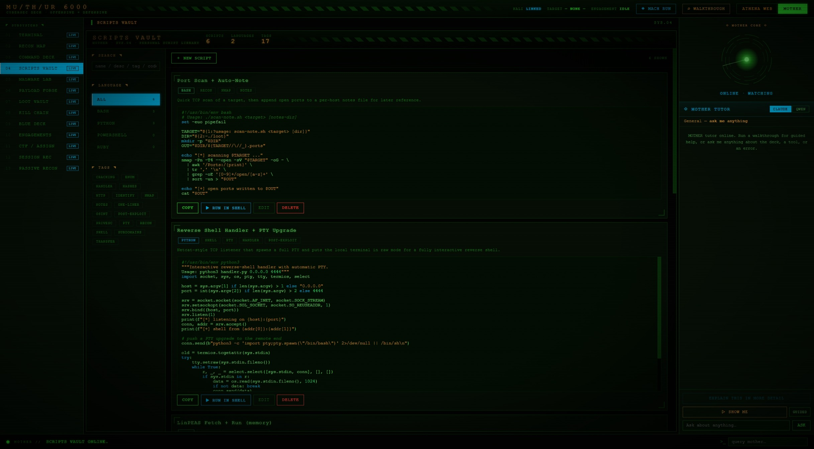

# MOTHER Deck — Athena (full system, private)



▶ **[Watch the deck demo video](media/cyber-demo.mp4)** — GitHub plays it in the browser.

Private, scrubbed backup of the complete Athena system: the **web-builder
pipeline** plus the **MOTHER cybersecurity deck** (a personal red/blue learning
lab). Secrets, API keys, client data, and finished client sites have been
removed; the code and lab tooling are intact.

> **Private repository.** This includes offensive security tooling intended
> **only** for use against systems you own or are explicitly authorized to test
> (your own lab VMs, CTF targets, engagements with permission). It is kept private
> deliberately and is not for public distribution.

---

## Two halves

### 1. Web builder (`backend/src/pipeline`, `frontend`)
The lead → build → review → deploy pipeline and the control-bridge UI. See the
public `athena-web-builder` release for full docs on this half; it is identical
here.

### 2. MOTHER cyber deck
A self-contained security lab UI under `frontend/public/cyber/` plus two backend
surfaces:

- **`backend/src/routes/reconRoutes.ts`** — a **passive OSINT aggregator**. It
  orchestrates standard, read-only Kali tools (crt.sh, theHarvester, subfinder,
  amass, and Shodan's pre-scanned DB), validates domains against an injection
  guard, keeps secrets out of argv/history, and correlates results. Passive only.
- **`backend/src/pty.ts`** — a **web terminal relay** (xterm.js ↔ shell over
  WebSocket; ssh/wsl/docker/local/VM backends). This is remote code execution by
  design, so it is **disabled unless `ATHENA_TERMINAL_ENABLED=1`**, bound to
  localhost, and gated by a per-run token.
- **`backend/src/learn.ts`** — a local tutor/guided-demo planner for the deck.

The deck's static pages (recon map, blue-team log analysis, command reference,
payload/lab tooling, kill-chain & engagement trackers, session recorder) live in
`frontend/public/cyber/`.

### Ethics / scope
Everything in the deck is for **authorized, defensive, and educational use on your
own infrastructure or explicit engagements**. Do not point it at systems you do
not own or have written permission to test.

---

## Quick start

```bash
npm install
cp .env.example backend/.env.local     # fill in your values
npm run dev                            # backend :3001, frontend :5173
```

The web builder runs with localhost defaults. Deck features stay dark until you
opt into them via env (`ATHENA_TERMINAL_ENABLED`, `SHODAN_API_KEY`, VM settings).

See [`.env.example`](./.env.example) for every setting. `SECURITY-HARDENING-REPORT.md`
documents the backend hardening (loopback binding, injection guards, SSRF
protection, secret hygiene).

## License

MIT — see [LICENSE](./LICENSE).
